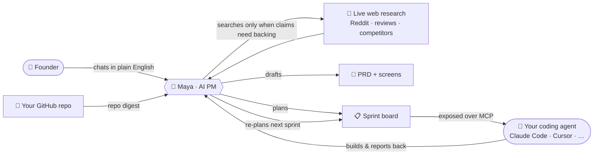

<p align="center">
  <picture>
    <source media="(prefers-color-scheme: dark)" srcset="docs/assets/logo-dark.svg">
    
  </picture>
</p>

<p align="center"><b>An AI product manager for people who can build but can't <i>product</i>.</b></p>

<p align="center">
  Bring an idea. Chat with Maya. Leave with a researched PRD and a sprint board<br>
  your coding agent can pick up and build from — over MCP.
</p>

<p align="center">
  
  
  
  
  
  
  
  
</p>

---

## The problem

A new generation of founders can *build* — they have Claude Code, Cursor, Lovable, an idea, and momentum. What they don't have is a **product manager**: someone to pressure-test the idea, find out who actually wants it, cut scope honestly, and turn "a vibe" into a buildable plan. So they build the wrong thing, beautifully, and ship it to silence.

**ProductSense is that product manager.** Her name is Maya.

## What it does

You talk to Maya in plain English — *"I want to build X"* or *"I shipped X and nobody's using it."* She:

1. **Thinks first, researches when it matters** — Maya reasons from her own product sense, and reaches for live web research only when a claim needs real-world backing: Reddit threads, app-store reviews, competitor pages, forums — first-person evidence, not marketing fluff.
2. **Pushes back** — she's a coach, not a yes-man. She forces scope decisions, names the riskiest assumption, and refuses "all of it."
3. **Writes the spec** — a plain-language PRD, target users, positioning/wedge, the MVP cut, and greyscale screens — all readable by a non-technical founder.
4. **Builds the sprint board** — intent-level tasks your coding agent can actually pick up.
5. **Grounds in your repo** — connect a GitHub repo and Maya ingests a digest (README, packages, file tree) so her tech advice matches the codebase you actually have.
6. **Closes the loop over MCP** — your coding agent connects to the board, pulls tasks, builds, and reports progress back. Maya re-plans the next sprint with you, grounded in what actually got built.

> Maya owns *what to build and why.* Your coding agent owns *how.* ProductSense is the missing handshake between them.

## How it works



Maya is a **single agent** — one Gemini 3.1 Pro brain with dynamic thinking that holds every tool herself. No sub-agents, no delegation chain: the model that coaches you is the same model that reads the evidence, so nothing gets lost in translation between a "researcher" and a "synthesizer."

## One brain, three kinds of tools

| Tools | What they do |
|------|--------------|
| `ask_founder` | The steering interrupt — Maya pauses mid-turn to put a real decision in front of you, and resumes when you answer. |
| Domain tools (~30) | Everything that writes the product record: artifacts, personas, solutions, features, PRD sections, decisions, sprints, `read_attachment` for your uploaded docs. All backed by Supabase. |
| Research tools (3) | `web_search` · `reddit_research` · `crawl_website`, via Firecrawl. Hard budget of 5 searches per turn; raw results are pruned from context after each turn once synthesized. |

## What makes it different

- **Research grounded in real voices.** Maya leads with Reddit threads + comments, app-store reviews (the 1–3★ ones), and forums — where the unmet need actually lives — over vendor marketing. And she only searches when a claim needs it; general product judgment comes from her own reasoning.
- **A coherence graph, not a doc dump.** Every artifact (problem → users → friction → positioning → PRD → sprint) is a node wired to what it came from. Change one upstream and everything downstream is flagged for review. The database — not chat history — is the source of truth.
- **Living artifacts.** Nothing is write-once. Maya edits cards, supersedes stale ones, and keeps the record coherent across sessions and across your agent's build.
- **A conversation, not a firehose.** One move per turn, then she hands back to you. No 1,300-line spec for a date picker.
- **Repo-grounded tech advice.** The GitHub digest keeps Maya honest about your stack and file layout — no hallucinated components.
- **The MCP loop.** The sprint board is a hosted, key-authed MCP endpoint — your coding agent pulls work and reports progress, turning the PRD into a live build cycle.

## Tech stack

| Layer | Choice |
|------|--------|
| Frontend | React 18 · Vite · Tailwind · shadcn/ui |
| Backend | Python 3.12 · FastAPI |
| Agent | [`deepagents`](https://github.com/langchain-ai/deepagents) on LangGraph — a single coordinator holding all tools, with a Postgres checkpointer and context summarization |
| LLM | Vertex AI · **Gemini 3.1 Pro** (dynamic thinking) |
| Data + auth | Supabase (Postgres) |
| Web research | Firecrawl |
| Repo grounding | GitHub OAuth + repo-digest ingestion |
| Coding-agent bridge | Hosted **MCP** (Streamable HTTP), key-authed, served by the API |
| Infra | Google Cloud Run (scale-to-zero) · Secret Manager · LangSmith tracing |

### A note on architecture

Maya started life as an orchestrator with a team of Flash-tier research sub-agents. We killed the team. Two A/B benchmarks drove it: a Pro orchestrator beat a Flash one on reliability *and* cost ([`apps/api/scripts/bench_compare.py`](apps/api/scripts/bench_compare.py)), and Pro doing its own research beat a Flash sub-agent doing the same task with the same tools — the Pro brain caught a false premise the sub-agent happily built on ([`scripts/bench_research_ab.py`](scripts/bench_research_ab.py)). The lesson: don't put a weaker model in the thinking path. Context stays lean without isolation because raw search results are pruned after each turn.

## Project structure

```
ProductSense/
├── apps/
│   ├── web/     React founder UI (chat + PRD / Sprint / Decisions / Screens tabs)
│   ├── api/     FastAPI — the Maya agent, domain + research tools, the coherence
│   │            graph, GitHub integration, and the hosted MCP endpoint
│   └── mcp/     MCP server bits for the coding-agent bridge
├── packages/
│   ├── prompts/        prompt files (markdown), loaded at backend startup
│   └── shared-types/   shared TypeScript types
├── supabase/migrations/   schema (projects, artifacts, decisions, sprints, …)
├── scripts/               benchmarks (end-to-end + research A/B)
├── docs/                  architecture, MCP, design notes
└── pnpm-workspace.yaml
```

## Getting started

> Requires Node 20+, pnpm, Python 3.12, a Supabase project, a Google Cloud project with Vertex AI, and a Firecrawl key.

```bash
# 1. install JS workspace deps
pnpm install

# 2. configure environment (never commit real keys — .env is gitignored)
cp .env.example .env        # then fill in Supabase / Vertex / Firecrawl values

# 3. backend  (http://localhost:8000)
cd apps/api && pip install -r requirements.txt && uvicorn main:app --reload

# 4. frontend (http://localhost:5173)
pnpm --filter web dev
```

The backend authenticates to Vertex AI via Application Default Credentials (`gcloud auth application-default login`). See [`docs/ARCHITECTURE.md`](docs/ARCHITECTURE.md) and [`docs/MCP.md`](docs/MCP.md) for the full picture.

## Status

Live and running end-to-end on Google Cloud Run (single-tenant). Active development — the audience is **non-technical, first-time founders**; "experienced shippers" are explicitly out of scope for v1.

## License

Not yet licensed — © the authors, all rights reserved until a license is chosen.

---

<p align="center"><i>Bring an idea, leave with a sprint board your coding agent can build from.</i></p>
